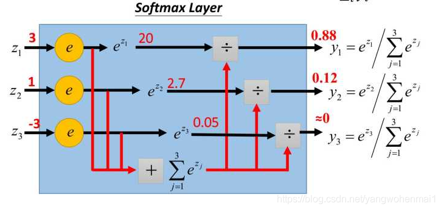

# 计算公式

## 卷积核和下层卷积大小

n为我们输入的矩阵的大小,输入层n*n,16x16,n=16.f为卷积和大小,比如5x5,f=5.p为一边padding的大小.

向下取整
$$
 \frac{n-f+2p}{s} +1 
$$

## 池化层后池化结果大小

池化层的输出大小公式也与卷积层一样，由于没有进行填充，所以p=0，可以简化为,但是好像也有填充的
$$
\frac{n-f}{s} +1
$$

# 网络层

## softmax层

将多维向量权重映射为各维出现的概率,各维度出现概率和为1

对于k个分类结果向量,其中第i个结果出现的概率为
$$
s_i=\frac{e^{z_i}}{e^{z_1}+e^{z_2}+...+e^{z_k}}
$$
其中所有分类结果出现的总和为
$$
\sum=\frac{e^{z_1}+e^{z_2}+...+e^{z_k}}{e^{z_1}+e^{z_2}+...+e^{z_k}}=1
$$

# FAQ

## 图片预处理问什么要归一化

可以解决图片过曝,噪声

学习率因为红绿蓝分量分布不均匀而造成的梯度下降不稳定

! 做预处理时,一定要按照图片集的均值和方差来做预处理.不同数据集的均值和方差不同.

可以参考这个[链接](https://zhuanlan.zhihu.com/p/35597976)